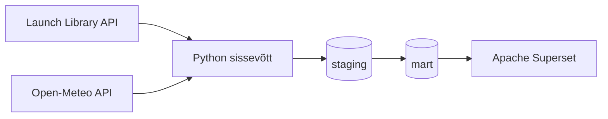

# Globaalsete kosmosestartide ja ilmastikutingimuste analüüs

## Äriküsimus

Millised ettevõtted planeerivad lähiajal enim kosmosestarte ja kui suur on ilmastikust tulenev edasilükkamise risk stardiplatvormi asukohas?

Projekt aitab analüüsida planeeritud kosmosestarte ning hinnata ilmastikutingimustest tulenevaid võimalikke riske stardi toimumisel.

**Mõõdikud**

1. Planeeritud startide arv ettevõtte kohta järgmise 30 päeva jooksul. HELENI kommentaar: visuaal 1 - horisontaalne tulpdiagramm kus on TOP 5 ettevõtte nimed ja planeeritavate startide arv
2. Kõige aktiivsemad stardiplatvormid planeeritud startide arvu järgi. HELENI kommentaar: visuaal 2 - horisontaalne tulpdiagramm kus on TOP 5 asukoha nimed ja planeeritavate startide arv (tulba võime värvida vastavalt TOP5 ettevõtete värvidele, tekib stacked bar chart)
3. Riskiskoor arvutatakse tuulekiiruse, sademete ja nähtavuse põhjal.

HELENI kommentaar: dashboardi hea näide https://www.slideteam.net/cyber-risk-impact-and-likelihood-analysis-dashboard.html
NASA tingimused ilmadele et saaks startida https://www3.nasa.gov/centers/kennedy/pdf/167476main_Weather-07R.pdf

## Arhitektuur



Täpsem kirjeldus: `docs/arhitektuur.md`

## Andmestik

| Allikas                           | Tüüp | Ajas muutuv?           | Roll                           |
| --------------------------------- | ---- | ---------------------- | ------------------------------ |
| The Space Devs Launch Library API | API  | Jah, mitu korda päevas | Planeeritud kosmosestardid        |
| Open-Meteo API                    | API  | Jah, tunnipõhiselt     | Stardiplatvormide ilmaandmed |

## Stack

| Komponent        | Tööriist                                        |
| ---------------- | ----------------------------------------------- |
| Sissevõtt        | Python                                          |
| Transformatsioon | Python + SQL                                    |
| Andmehoidla      | PostgreSQL (pgDuckDB)                           |
| Näidikulaud      | Apache Superset                                 |
| Orkestreerimine  | Käsitsi käivitatavad skriptid                   |
| Konteinerid      | Docker Compose                                  |


## Andmevoog lühidalt

1. Launch Library API-st laaditakse järgmise 30 päeva planeeritud kosmosestardid.

2. Open-Meteo API-st laaditakse stardiplatvormide ilmaandmed.

3. Andmed salvestatakse PostgreSQL staging kihti:
   * staging.launches_raw
   * staging.weather_raw

4. Transformatsioonide käigus arvutatakse:
   * ettevõtete planeeritud startide arv;
   * stardiplatvormide planeeritud startide arv;
   * ilmastikuriski skoor ja riskitase.

5. Käivitatakse andmekvaliteedi testid.

6. Tulemused kuvatakse Apache Superset dashboardil.


## Käivitamine

```bash
# 1. Kopeeri keskkonnamuutujad
cp .env.example .env

# 2. Käivita PostgreSQL 
docker compose up -d

# 3. Kontrolli, et andmebaas töötab
docker compose ps

# 4. Paigalda Pythoni sõltuvused
pip install -r requirements.txt

# 5. Käivita andmevoog
python scripts/load_launches.py

# 6. Salvesta PostgreSQL-i 
python scripts/load_to_postgres.py

# 7. Käivita SQL transformatsioonid
cat scripts/01_transform.sql | docker compose exec -T db psql -U praktikum -d kosmos
cat scripts/03_location_transform.sql | docker compose exec -T db psql -U praktikum -d kosmos

# 8. Käivita andmekvaliteedi testid
cat scripts/02_quality_tests.sql | docker compose exec -T db psql -U praktikum -d kosmos

# 9. Loo visualiseerimine
python scripts/create_chart.py
```

## Saladused ja konfiguratsioon

Projekt kasutab .env faili keskkonnamuutujate hoidmiseks.

Reposse lisatakse ainult .env.example.

Päris .env fail on lisatud .gitignore faili ning ei jõua GitHubi.

## Andmekvaliteedi testid

Staging
launch_id ei tohi olla tühi (NOT NULL).
launch_id peab olema unikaalne.
provider_name ei tohi olla tühi.
Mart
company_launches.launch_count peab olema positiivne.
launches_by_location.launch_count peab olema positiivne.

## Projekti struktuur

```text
.
├── README.md
├── .env.example
├── .gitignore
├── compose.yml
├── docs/
│ ├── arhitektuur.md
│ └── progress.md
├── scripts/
│ ├── load_launches.py
│ ├── load_to_postgres.py
│ ├── test_api.py
│ ├── test_postgres.py
│ ├── 01_transform.sql
│ ├── 02_quality_tests.sql
│ ├── 03_location_transform.sql
│ └── create_chart.py
├── data/
│ ├── raw/
│ └── processed/
└── output/

```

## Kokkuvõte, puudused ja edasiarendused

### Kokkuvõte

* Launch Library API ühendus töötab.
* PostgreSQL staging ja mart kihid on realiseeritud.
* Loodud on ettevõtete ja stardiplatvormide analüütikatabelid.
* Rakendatud on andmekvaliteedi testid.
* Docker Compose võimaldab andmebaasi kiiresti käivitada.

### Puudused

* Ilmastikuriski skoor vajab täiendavat valideerimist.
* Riskiskoori mudelit võiks valideerida ajalooliste andmetega.

### Mis edasi

* Täiustada ilmastikuriski mudelit stardiplatvormi-spetsiifiliste piirväärtustega.
* Lisada ajalooliste ilmaandmete analüüs.
* Automatiseerida töövoog Airflow abil.
* Täiendada Apache Superseti dashboardi täiendavate KPI-dega.

## Meeskond

| Nimi         | Roll                               |
| ------------ | ---------------------------------- |
| Katrin Laur  | Andmevoog, PostgreSQL, transformatsioonid |
| Helen Vellau | Dashboard, visualiseerimine, dokumentatsioon |

```
```
