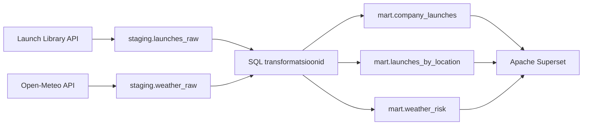

# Kosmosestartide ja ilmastikutingimuste analüüs

## Äriküsimus

Millised ettevõtted planeerivad järgmise 30 päeva jooksul enim kosmosestarte ning kui suur on ilmastikust tulenev stardi edasilükkamise risk peamistes stardiasukohtades?

Projekt aitab analüüsida planeeritud kosmosestarte ning hinnata ilmaoludest tulenevaid võimalikke riske enne stardi toimumist.

---

# Mõõdikud

## 1. Planeeritud startide arv ettevõtte kohta

Loendatakse mitu planeeritud starti on igal ettevõttel järgmise 30 päeva jooksul.

## 2. Kõige aktiivsemad stardiplatvormid

Loendatakse millistes stardiasukohtades toimub enim planeeritud starte.

## 3. Ilmastikuriski skoor

Arvutatakse ilmastikutingimustest tulenev riskiskoor vahemikus 0–100.

Riskiskoor põhineb:

* tuulekiirusel
* sademetel
* nähtavusel

## 4. Ilmastikuriski tase

Riskiskoor teisendatakse tasemeks:

* Madal
* Keskmine
* Kõrge

---

# Andmeallikad

| Allikas                           | Tüüp | Ajas muutuv?           | Roll                           |
| --------------------------------- | ---- | ---------------------- | ------------------------------ |
| The Space Devs Launch Library API | API  | Jah, mitu korda päevas | Planeeritud kosmosestardid     |
| Open-Meteo API                    | API  | Jah, tunnipõhiselt     | Stardiplatvormide ilmaennustus |

---

# Andmevoog



---

# Andmebaasi kihid

| Kiht    | Roll                                                             |
| ------- | ---------------------------------------------------------------- |
| staging | Hoiab API-dest saadud toorandmeid võimalikult muutmata kujul     |
| mart    | Hoiab analüütikaks ettevalmistatud kokkuvõtte- ja raporttabeleid |

### Staging kihis

* staging.launches_raw
* staging.weather_raw

### Mart kihis

* mart.company_launches
* mart.launches_by_location
* mart.weather_risk

---

# Tööjaotus

| Liige        | Vastutus                                                                        |
| ------------ | ------------------------------------------------------------------------------- |
| Katrin Laur  | API integratsioonid, PostgreSQL, SQL transformatsioonid, andmekvaliteedi testid |
| Helen Vellau | Apache Superset dashboard, visualiseerimine, dokumentatsioon                    |

---

# Riskid

| Risk                                                                     | Mõju                                                    | Maandus                                                                  |
| ------------------------------------------------------------------------ | ------------------------------------------------------- | ------------------------------------------------------------------------ |
| Launch Library API muudab andmestruktuuri                                | Sissevõtt võib katkeda                                  | Kontrollitakse API vastuseid ning kasutatakse veakäsitlust               |
| Stardiplatvormi koordinaadid puuduvad                                    | Ilmaandmeid ei saa pärida                               | Puudulike andmetega kirjed märgitakse eraldi                             |
| Ilmaprognoos muutub kiiresti                                             | Riskihinnang võib erineda tegelikust ilmast stardi ajal | Kasutatakse viimast saadaolevat prognoosi ning salvestatakse päringu aeg |
| Riskiskoori piirväärtused ei pruugi sobida kõikidele stardiplatvormidele | Risk võib olla üle- või alahinnatud                     | Piirväärtused dokumenteeritakse ning neid saab vajadusel kohandada       |

---

# Privaatsus ja turve

Projekt kasutab avalikke API-sid.

Keskkonnamuutujad hoitakse failis `.env`.

Reposse lisatakse ainult:

```text
.env.example
```

Päris konfiguratsioonifail:

```text
.env
```

on lisatud `.gitignore` faili ning ei jõua GitHubi.

Andmebaasi ühendused kasutavad samuti keskkonnamuutujaid.

---

# Tehnilised katsetused

## Launch Library API

Kontrolliti ühendust Launch Library API-ga.

Tulemus:

* HTTP vastuskood 200
* Andmed saadi edukalt kätte

## Open-Meteo API

Kontrolliti ühendust Open-Meteo API-ga.

Tulemus:

* HTTP vastuskood 200
* Ilmaennustuse andmed saadi edukalt kätte

## PostgreSQL

Kontrolliti andmebaasi ühendust SQLAlchemy abil.

Tulemus:

* Ühendus PostgreSQL andmebaasiga töötab
* Andmed laaditakse edukalt staging kihti
* Andmekvaliteedi testid käivituvad edukalt

---

# Andmekvaliteedi testid

Projektis kasutatakse järgmisi kvaliteedikontrolle:

1. launch_id ei tohi olla NULL.
2. launch_id peab olema unikaalne.
3. provider_name ei tohi olla NULL.
4. company_launches.launch_count peab olema positiivne.
5. launches_by_location.launch_count peab olema positiivne.
6. weather_raw tuulekiirus ei tohi olla NULL.
7. weather_risk_score peab jääma vahemikku 0–100.

---

# Projekti struktuur

```text
.
├── README.md
├── .env.example
├── docs/
│   ├── arhitektuur.md
│   └── progress.md
├── scripts/
│   ├── load_launches.py
│   ├── load_weather.py
│   ├── load_to_postgres.py
│   ├── 01_transform.sql
│   ├── 02_quality_tests.sql
│   ├── 03_location_transform.sql
│   ├── 04_weather_risk.sql
│   ├── test_api.py
│   └── test_postgres.py
└── output/
```

---

# Kokkuvõte

Valmis on:

* Launch Library API integratsioon
* Open-Meteo API integratsioon
* PostgreSQL staging ja mart kihid
* SQL transformatsioonid
* Andmekvaliteedi testid
* Ilmastikuriski arvutamine

---

# Puudused ja edasiarendused

## Puudused

* Ilmastikuriski piirväärtused põhinevad üldistel tingimustel ega ole kohandatud iga stardiplatvormi jaoks eraldi.
* Dashboard vajab esmakordsel kasutamisel käsitsi seadistamist.

## Võimalikud edasiarendused

* Automaatne töövoo ajastamine Airflow abil.
* Täpsemad stardiplatvormi-spetsiifilised ilmastikureeglid.
* Pikema perioodi ajalooliste ilmaandmete analüüs.
* Täiendavad KPI-d Superseti dashboardil.

---

# Meeskond

| Nimi         | Roll                                                                            |
| ------------ | ------------------------------------------------------------------------------- |
| Katrin Laur  | API integratsioonid, PostgreSQL, SQL transformatsioonid, andmekvaliteedi testid |
| Helen Vellau | Apache Superset dashboard, visualiseerimine, dokumentatsioon                    |
