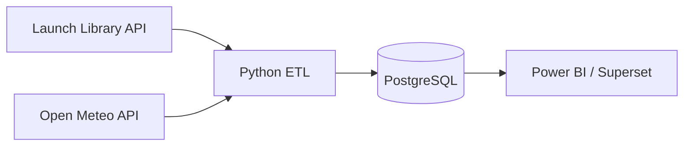

# Äriküsimus

Millised ettevõtted planeerivad lähiajal enim kosmosestarte ja kui suur on ilmastikust tulenev edasilükkamise risk stardiplatvormi asukohas?

---

# Mõõdikud

## 1. Startide arv ettevõtte kohta
Loendatakse mitu planeeritud starti on igal ettevõttel järgmise 30 päeva jooksul.

## 2. Ilmastikurisk stardiplatvormis
Arvutatakse halbade ilmastikutingimuste osakaal stardi ajal:
- tugev tuul
- vihm
- halb nähtavus

## 3. Kõige aktiivsemad stardiplatvormid
Loendatakse millistes asukohtades toimub enim starte.

---

# Andmeallikad

## The Space Devs Launch Library API
https://lldev.thespacedevs.com/2.2.0/launch/upcoming/

Sisaldab:
- stardi aeg
- ettevõte
- stardiplatvorm
- koordinaadid

Andmed uuenevad regulaarselt.

## Open-Meteo API
https://api.open-meteo.com

Kasutatakse ilmastikuandmete saamiseks stardiplatvormi koordinaatide põhjal.

Andmed uuenevad tunnipõhiselt.

---

# Andmevoog

---

# Andmebaasi kihid

## Raw layer
Salvestatakse API vastused muutmata kujul.

## Clean layer
Puhastatud ja ühendatud andmed.

## Analytics layer
Agregeeritud mõõdikud dashboardi jaoks.

---

# Tööjaotus

Projekt tehakse individuaalselt.

Rollid:
- Andmeallikad ja API päringud
- Andmete töötlemine
- Andmebaasi haldus
- Visualiseerimine
- Dokumentatsioon

---

# Riskid

## 1. API limiidid või katkestused
Maandamine:
- cache
- lokaalsed testfailid

## 2. Ilmaennustuse muutumine kiiresti
Maandamine:
- salvestatakse päringu aeg
- kasutatakse viimast prognoosi

## 3. Koordinaadid võivad puududa
Maandamine:
- filtreeritakse puudulikud kirjed välja

---

# Privaatsus ja turve

Projekt kasutab ainult avalikke andmeid.

API võtmeid ei kasutata.
Kui tulevikus lisanduvad võtmed:
- kasutatakse `.env` faili
- `.env` lisatakse `.gitignore` faili
